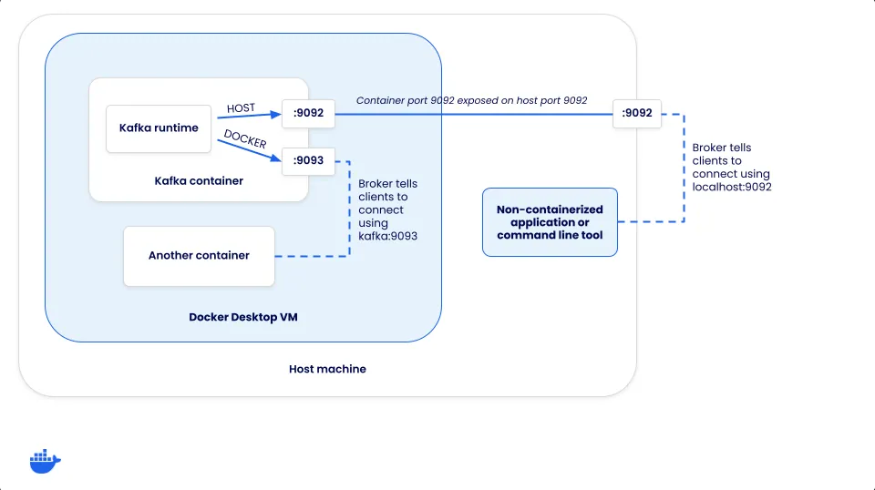

## 事件與訊息

+ [Use Cases](https://kafka.apache.org/uses)
+ [Apache Kafka Quickstart](https://kafka.apache.org/quickstart)
+ [Basic Kafka Operations](https://kafka.apache.org/documentation/#basic_ops)
    - [Adding and removing topics](https://kafka.apache.org/documentation/#basic_ops_add_topic)
    - [Modifying topics](https://kafka.apache.org/documentation/#basic_ops_modify_topic)

本節主要說明並實踐操作 Kafka 的事件與訊息傳遞流程，主要流程參考文獻連結 [Apache Kafka Quickstart](https://kafka.apache.org/quickstart)，並從中增加專案所需的設計方案

### Step 1: Get Kafka

由於本專案採用 Docker 環境建立 Kafka 服務，因此採用執行 Docker 指令抓取必要的容器映像檔

```
docker pull apache/kafka:latest
```

然而，考量最終採用 docker-compose 啟動服務，且有新增內容在映像檔的可能，建立 [kafka Dockerfile](../conf/docker/kafka/Dockerfile)，並由 [docker-compsoe](../conf/docker/docker-compose.yml) 使用該檔案並於相應 docker-compose 指令中建立新映像檔。

### Step 2: Start the Kafka environment

由於本專案採用 Docker 環境建立 Kafka，因此遵循文獻的範本，可以下列指令建立環境，並參考 [apache/kafka](https://hub.docker.com/r/apache/kafka) 在 Docker hub 的說明文獻，最終服務啟動句如下：

```
docker run -d -p 9092:9092 --name broker apache/kafka:latest
```

若服務正常啟動，可以下句進入容器：

```
docker exec --workdir /opt/kafka/bin/ -it broker sh
```

本專案基於上述操作，改由 docker-compsoe 啟動服務，並封裝操作細節於專案的運維 CLI 中，故上述操作命令對應如下：

```
## 啟動服務
kafka up

## 進入容器
kafak into --tag=kafka-broker
```

#### [Kafka Docker Image Usage Guide](https://github.com/apache/kafka/blob/trunk/docker/examples/README.md)

本文連結描述 Kafka 容器啟動如何設定配置資訊

##### Use input file for providing configs

利用 Docker 掛載 [KRaft](https://kafka.apache.org/documentation/#kraft) 配置所需的檔案，其掛載位置的 Docker 指令如下：

```
docker run --volume /path/to/property/folder:/mnt/shared/config -p 9092:9092 apache/kafka:latest
```

##### Using Environment Variables

利用 Docker 環境變數對應到 [KRaft](https://kafka.apache.org/documentation/#kraft) 配置所需參數，其對應規則如下：

+ 環境變數名稱皆為大寫
+ 環境變數名稱字首 ```KAFKA_```
+ KRaft 變數符號 ```.``` 替換為 ```_``` ( underscore )
+ KRaft 變數符號 ```_``` 替換為 ```__``` ( double underscore )
+ KRaft 變數符號 ```-``` 替換為 ```___``` ( triple underscore )

舉例來說：

+ KRaft 變數 ```abc.def``` 等於環境變數 ```KAFKA_ABC_DEF```
+ KRaft 變數 ```abc_def``` 等於環境變數 ```KAFKA_ABC__DEF```
+ KRaft 變數 ```abc-def``` 等於環境變數 ```KAFKA_ABC___DEF```

### Step 3: Create a topic to store your events

在 Kafka 中，事件的發佈與訂閱要透過主題 ( topic ) 運作；因此，在進入服務，並達到工作目錄 ( ```/opt/kafka/bin``` ) 後，可以執行以下指令建立主題：

```
bash kafka-topics.sh --create --topic quickstart-events --bootstrap-server localhost:9092
```

經由此指令，會告訴位於 localhost:9002 的 Kafka 服務建立一個名為 quickstart-events 的主題；若要檢查主題的狀態可以執行以下指令：

```
bash kafka-topics.sh --describe --topic quickstart-events --bootstrap-server localhost:9092
```

bash kafka-topics.sh --describe --topic quickstart-events --bootstrap-server kafka-broker:9092

### Step 4: Write some events into the topic

在 Kafka 中，客戶端可對以建立的主題來發送事件；因此，在進入服務，並達到工作目錄 ( ```/opt/kafka/bin``` ) 後，可以執行以下指令建立主題：

```
bash kafka-console-producer.sh --topic quickstart-events --bootstrap-server localhost:9092
>This is my first event
>This is my second event
```

需要注意，此功能會啟動一個 Producer 客戶端，若要離開請執行 ```Ctrl + C```；若不想進入客戶端，則可使用 Linux stdout 與多行文字輸入的技巧，改用以下指令執行：

```
bash kafka-console-producer.sh --topic quickstart-events --bootstrap-server localhost:9092 << EOF
This is my event 1
This is my event 2
EOF
```

### Step 5: Read the events

在 Kafka 中，客戶端可訂閱以建立的主題來讀取事件；因此，在進入服務，並達到工作目錄 ( ```/opt/kafka/bin``` ) 後，可以執行以下指令建立主題：

```
bash kafka-console-consumer.sh --topic quickstart-events --from-beginning --bootstrap-server localhost:9092
```

需要注意，此功能會啟動一個 Consumer 客戶端，若要離開請執行 ```Ctrl + C```。

### Step 6: [Connecting to Kafka from both containers and native apps](https://docs.docker.com/guides/kafka/#connecting-to-kafka-from-both-containers-and-native-apps)

在 Kafka 服務啟動後，進行前述章節的操作，皆是運作在單一容器內；因此，本節將以 Kafka 容器為外部 Client 與當前的容器溝通並說明 Kafka 環境變數 listeners 與 advertised.listeners 的用途。



如上圖所示，並參閱文獻，對於 Kafka 客戶連線有幾種方式：

+ 服務容器內客戶端：進入 Kafka 服務容器，使用其包括的腳本
+ 服務容器所在主機與外部主機：在主機下載 Kafka，並使用其封裝內目錄 ```bin``` 的腳本
+ 服務容器同虛擬網路內的額外容器：在容器內執行客戶端腳本

對於同虛擬網路的額外容器，可以看成模擬叢集服務、第三方服務 ( 如 Flink )、客製化客戶端應用程式 ( 使用 Python 等語言的應用程式 )；在此使用 Kafka 容器但不啟動服務，詳細設定參考本專案的 [docker-compose.yml](../conf/docker/docker-compose.yml)。

考量前述的連線方式，設計讓 Kafka 將來自 ```HOST``` 與 ```DOCKER``` 的連線者區分，實作主要基於 Kafka 的基礎運作邏輯。

每個 Kafka 服務都有一組監聽器 ( listeners ) 和通告監聽器 ( advertised.listeners )：

+ 監聽器 ( listeners ) 是 Kafka 實際監聽的連結埠。
+ 通告監聽器 ( advertised.listeners ) 是客戶端如何連接到服務。

因此，當用戶端執行服務時會，會執行如下流程：

1. 客戶端命令設定 ```--bootstrap-server [KAFKA-SERVICE-HOSTNAME]:9092```
2. Kafka 服務基於監聽器得知客戶端詢問
3. Kafka 通告監聽器回應實際連線的網址與連結埠

這樣的設計是考量 Kafka 叢集架構，當客戶端連接到 Kafka 叢集時，實際會連接到 Broker 是何網址與連結埠；因此，當用戶端連線時，代理程式會傳回一組連線 URL，用戶端隨後應使用這些 URL 進行連線以產生或使用訊息。

從運行結果來看，監聽器與通告監聽器會組成一個兌換表格，當來自 ```//0.0.0.0:9092``` 的訊問，因對應標籤 HOST 而回應 ```//localhost:9092```；而若其他容器訊問，則會因為得到 ```//localhost:9092``` 而無法執行，反之要詢問 ```//0.0.0.0:9093```，來得到 ```//kafka:9093``` 才可正常運行。

#### 專案範例

考量這兌換設計概念，本專案範例並無兌換必要，因此使用 ```HOST://:9092``` 設定且不額外設定 advertised.listeners，讓監聽與回應採用相同設定；但理解前述設定原則可以更好理解 Multiple nodes 或 Cluster 的設定規則。

執行本專案範例構築的環境，需執行如下命令：

```
## 啟動服務
kafka up

## 進入容器
kafak into --tag=kafka-client

## 對 kafka-broker 建立主題
bash kafka-topics.sh --create --topic quickstart-events --bootstrap-server kafka-broker:9092
```
